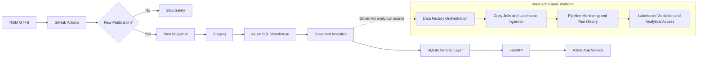
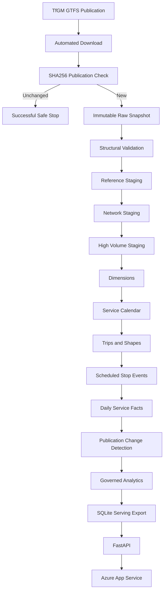
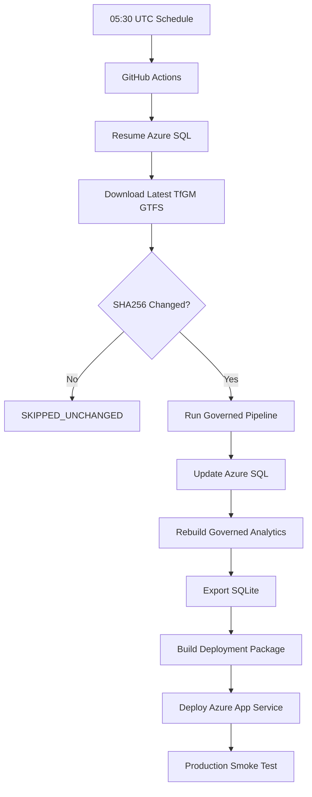
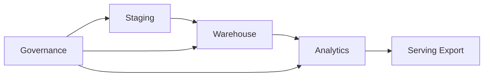
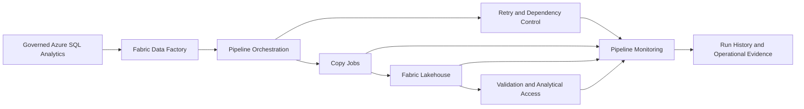
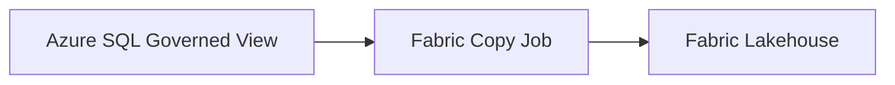
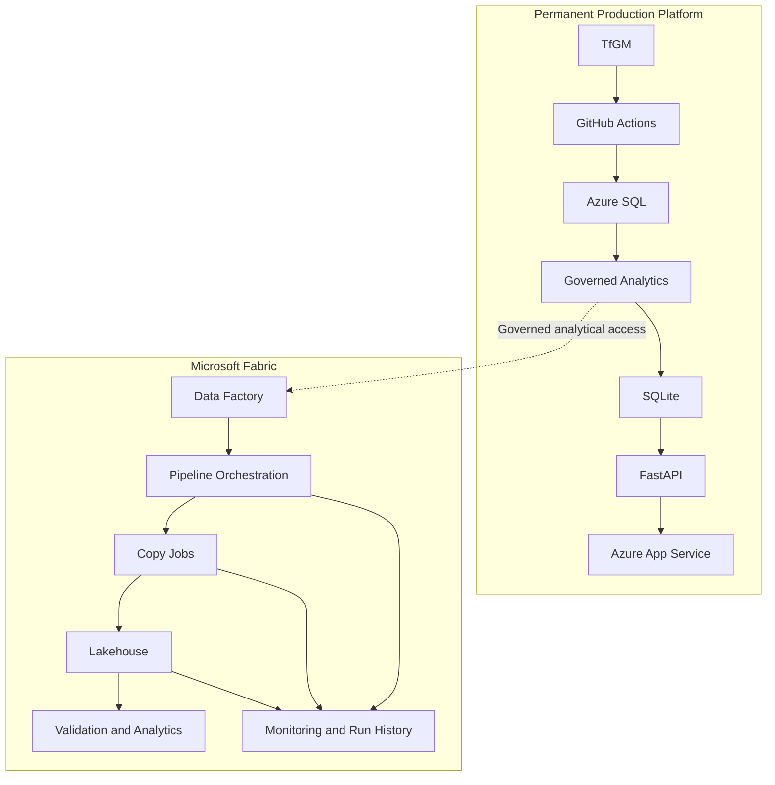
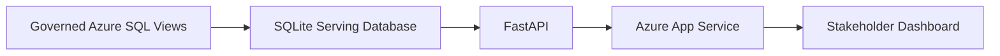

# Greater Manchester Transport Intelligence Platform


[](https://github.com/kamilkenny/greater-manchester-transport-data-platform/actions/workflows/quality-gate.yml)
[](https://github.com/kamilkenny/greater-manchester-transport-data-platform/actions/workflows/refresh-production.yml)

A cloud-based public transport **data engineering, orchestration and service intelligence platform** built from Transport for Greater Manchester (TfGM) GTFS timetable publications.

The platform preserves source publications, validates and models transport data in **Azure SQL**, creates governed analytical datasets, automates refresh and deployment through **GitHub Actions**, integrates **Microsoft Fabric Data Factory and Lakehouse capabilities**, and publishes a stakeholder-facing **FastAPI intelligence dashboard through Azure App Service**.

**Live dashboard:**  
https://gm-transport-intelligence-kamil.azurewebsites.net/

> The platform analyses scheduled public transport services. It is not a real-time vehicle tracking, passenger demand or punctuality system.

---

## Platform Architecture
## Automated scheduled ingestion of TfGM timetable publications with checksum-based change detection and idempotent processing.


The live production pathway remains independent of Microsoft Fabric.

Fabric operates as an additional enterprise data platform layer against governed analytical outputs, allowing orchestration, Lakehouse ingestion, validation and monitoring to be demonstrated without introducing a dependency into the public dashboard.

---

## End-to-End Engineering Flow



The processing design supports reproducibility, publication lineage, controlled reprocessing and separation between engineering workloads and public application serving.

---

## Data Engineering Layers

| Layer | Purpose |
|---|---|
| **Source** | Collect TfGM GTFS timetable publications |
| **Raw** | Preserve immutable source snapshots using SHA256 identity |
| **Validation** | Profile structures, required fields and record integrity |
| **Staging** | Load source-shaped GTFS records with publication lineage |
| **Warehouse** | Build typed dimensions, service calendars, trips and fact tables |
| **Analytics** | Publish governed reporting and intelligence views |
| **Governance** | Record source snapshots, pipeline runs and data quality evidence |
| **Serving** | Export approved analytics into a compact SQLite database |
| **Application** | Serve APIs and stakeholder intelligence through FastAPI |
| **Automation** | Execute scheduled production refresh through GitHub Actions |
| **Fabric** | Orchestrate governed datasets, Lakehouse ingestion, validation and monitoring |

---

## Automated Production Refresh

The production workflow runs automatically every day at **05:30 UTC**.



If TfGM has not published a new file, the workflow stops successfully without unnecessary warehouse processing or application deployment.

The workflow also includes retry handling for **Azure SQL serverless auto-resume**.

---

## Engineering and Governance Controls

The platform includes:

- SHA256 publication change detection
- immutable source snapshot preservation
- structural and referential data validation
- idempotent and recoverable processing
- source-to-warehouse lineage
- snapshot-level governance
- pipeline run auditing
- stage-level execution evidence
- publication comparison
- data quality reporting
- Azure SQL serverless retry handling
- automated Ruff quality checks
- automated pytest execution
- deployment package validation
- production API smoke testing
- production dashboard smoke testing
- GitHub production environment controls
- Fabric pipeline monitoring and execution history

---

## Azure SQL Data Platform

The engineering database is organised into governed functional layers.



### Staging

Preserves source-shaped GTFS data and publication lineage before transformation.

### Warehouse

Contains typed dimensions, routes, stops, operators, service calendars, trips, shapes, scheduled stop events and daily analytical facts.

### Analytics

Provides approved reporting and intelligence views for downstream applications and analytical tools.

### Governance

Stores publication snapshots, pipeline execution history and governed data quality evidence.

The public dashboard does **not** query multi-million-row engineering tables directly.

---

# Microsoft Fabric Platform

Microsoft Fabric has been integrated as a separate enterprise orchestration and analytical platform layer.

It reads governed Azure SQL analytical outputs without replacing or interrupting the permanent GitHub Actions production workflow.



## Fabric Capabilities Implemented

### Data Factory Orchestration

A dedicated Fabric pipeline has been created:

```text
PL_GM_Transport_Orchestration
```

The pipeline demonstrates controlled execution of governed transport analytical workloads.

### Azure SQL Connectivity

Fabric Data Factory connects to the existing governed Azure SQL platform using a dedicated connection.

The source remains the production analytical layer rather than raw GTFS or staging tables.

A representative governed source used in the implementation is:

```text
analytics.vw_operator_summary
```

### Copy Job Orchestration

A Fabric Copy Job has been configured to transfer governed analytical data from Azure SQL into the Fabric Lakehouse.



The implementation uses a **full-copy controlled load pattern** for curated analytical datasets.

### Fabric Lakehouse

A dedicated Lakehouse has been created:

```text
lh_gm_transport_intelligence
```

The Lakehouse provides a Fabric-native analytical storage layer for governed transport datasets and supports Spark SQL, OneLake access and downstream analytics.

### Pipeline Resilience

The Fabric orchestration includes:

- activity activation controls
- execution timeout
- retry handling
- retry intervals
- activity dependencies
- controlled source and destination configuration

The Copy Job activity is configured with retry handling for transient execution failures.

### Monitoring and Run History

Fabric monitoring is used as an operational component of the implementation rather than simply as a visual status check.

Monitoring provides:

- pipeline execution status
- Copy Job execution status
- source and destination lineage
- rows read
- rows written
- data read
- data written
- execution duration
- run identifiers
- start and end times
- throughput
- failure reasons
- activity history
- operational run evidence

A successful governed Azure SQL to Fabric execution has already been recorded through the Fabric monitoring environment.

### Lakehouse Validation

Lakehouse validation is being implemented through Fabric analytical interfaces including:

- Spark SQL
- SQL analytics endpoint
- OneLake paths
- notebook-based inspection
- schema validation
- table registration verification

This ensures that successful data movement is also validated at the analytical storage layer rather than relying only on pipeline success status.

---

## Fabric Architecture Role

Fabric is intentionally isolated from the permanent public application dependency chain.



If the Fabric trial is stopped or expires, the live dashboard and its permanent automated refresh continue independently.

---

## Dashboard Intelligence

The public dashboard provides:

- network and timetable coverage
- bus and tram comparison
- route service intelligence
- stop service intelligence
- operator contribution
- scheduled activity mapping
- accessibility reporting
- publication change monitoring
- pipeline health
- governed data quality results

The dashboard is designed for stakeholders who need an interpretable view of scheduled Greater Manchester transport activity without interacting directly with engineering databases.

---

## Production Serving Architecture



A compact read-only SQLite serving layer protects the public application from heavy analytical database workloads.

---

## Technology Stack

| Area | Technologies |
|---|---|
| **Data Engineering** | Python, SQL, GTFS, Azure SQL, SQLite |
| **Cloud** | Microsoft Azure, Azure App Service |
| **Automation** | GitHub Actions |
| **Enterprise Orchestration** | Microsoft Fabric Data Factory |
| **Lakehouse** | Microsoft Fabric Lakehouse, OneLake |
| **Fabric Analytics** | Spark SQL, SQL analytics endpoint, Notebooks |
| **Application** | FastAPI, HTML, CSS, JavaScript |
| **Quality** | pytest, Ruff, data quality checks, smoke tests |
| **Reporting** | Power BI, SSRS |
| **Integration Demonstration** | SSIS |

---

## Repository Structure

```text
.github/workflows/       CI and production automation
config/                  Application and environment configuration
data/                    Raw, processed and serving data
deploy/azure/            Azure App Service deployment
docs/                    Architecture and engineering evidence
fabric/                  Microsoft Fabric implementation
powerbi/                 Power BI reporting
reports/ssrs/            SSRS reporting
sql/                     Staging, warehouse, analytics and governance SQL
src/transport_platform/  Python platform source
ssis/                    SSIS implementation
tests/                   Unit, integration and data quality tests
```

---

## Project Status

| Capability | Status |
|---|---|
| TfGM GTFS ingestion | ✅ Complete |
| Immutable snapshot preservation | ✅ Complete |
| GTFS structural validation | ✅ Complete |
| Azure SQL staging | ✅ Complete |
| Azure SQL warehouse | ✅ Complete |
| Governed analytical layer | ✅ Complete |
| Publication change intelligence | ✅ Complete |
| SQLite serving layer | ✅ Complete |
| FastAPI dashboard | ✅ Complete |
| Azure App Service deployment | ✅ Complete |
| Automated quality gate | ✅ Complete |
| Daily production refresh | ✅ Complete |
| Azure production smoke testing | ✅ Complete |
| Fabric workspace | ✅ Complete |
| Fabric Lakehouse | ✅ Complete |
| Fabric Azure SQL connection | ✅ Complete |
| Fabric Data Factory pipeline | ✅ Complete |
| Fabric Copy Job | ✅ Complete |
| Fabric retry configuration | ✅ Complete |
| Fabric monitored pipeline execution | ✅ Complete |
| Fabric Lakehouse validation | 🟡 Final validation in progress |
| Fabric failure-handling branch | 🟡 Final implementation stage |
| SSIS demonstration | Planned |
| SSRS operational reporting | Planned |
| Power BI analytical reporting | Planned |

---

## Current Platform Outcome

The project currently demonstrates an end-to-end combination of:

```text
Public Data Acquisition
        ↓
Automated Data Engineering
        ↓
Data Validation and Governance
        ↓
Azure SQL Warehousing
        ↓
Governed Analytical Modelling
        ↓
Microsoft Fabric Orchestration
        ↓
Lakehouse Integration and Monitoring
        ↓
Automated Production Deployment
        ↓
Public Stakeholder Intelligence
```

This architecture demonstrates both **operational data engineering** and **enterprise analytical platform integration** while maintaining separation between engineering workloads, analytical orchestration and public application serving.

---

## Data Source

The project uses timetable data published by **Transport for Greater Manchester (TfGM)** in GTFS format.

Every downloaded publication is preserved before transformation so that warehouse records, governed analytics and downstream intelligence can be traced back to their originating source snapshot.

---

## Production Workflow

```text
TfGM Publication
       ↓
GitHub Actions
       ↓
SHA256 Change Detection
       ↓
Raw Snapshot
       ↓
Azure SQL Warehouse
       ↓
Governed Analytics
       ↓
SQLite Serving Database
       ↓
FastAPI
       ↓
Azure App Service
       ↓
Greater Manchester Transport Intelligence Dashboard
```

---

## Fabric Analytical Workflow

```text
Governed Azure SQL Analytics
       ↓
Microsoft Fabric Data Factory
       ↓
Pipeline Orchestration
       ↓
Copy Jobs
       ↓
Fabric Lakehouse / OneLake
       ↓
Validation and Analytical Access
       ↓
Pipeline Monitoring
       ↓
Run History and Operational Evidence
```

---

**Designed and modelled by Kamil Ridwan**
