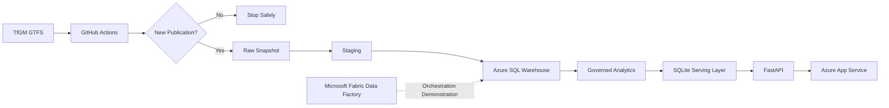
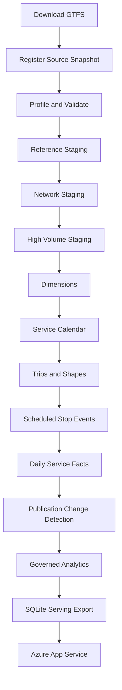
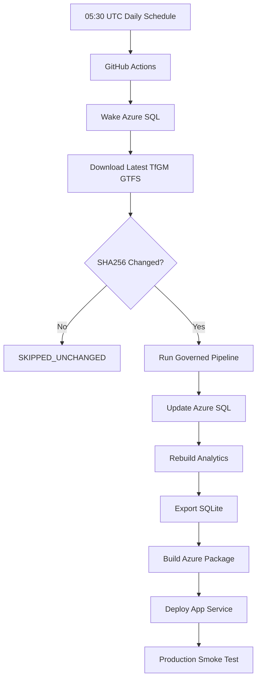
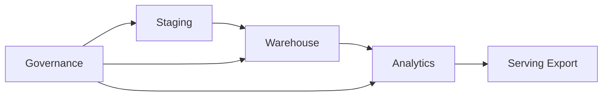
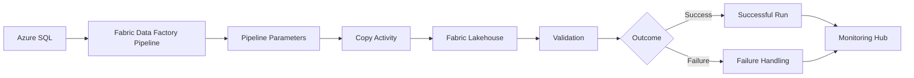

# Greater Manchester Transport Intelligence Platform

[](https://github.com/kamilkenny/greater-manchester-transport-data-platform/actions/workflows/quality-gate.yml)
[](https://github.com/kamilkenny/greater-manchester-transport-data-platform/actions/workflows/refresh-production.yml)

A cloud based public transport data engineering and service intelligence platform built from **Transport for Greater Manchester (TfGM) GTFS timetable publications**.

The platform preserves source publications, validates and models transport data in **Azure SQL**, creates governed analytical datasets, and publishes a **FastAPI intelligence dashboard through Azure App Service**.

**Live dashboard:**  
https://gm-transport-intelligence-kamil.azurewebsites.net/

> The platform analyses scheduled public transport services. It is not a real time vehicle tracking, passenger demand or punctuality system.

---

## Platform Architecture



The production platform separates source ingestion, engineering storage, governed analytics and public serving so that the dashboard does not query raw GTFS data directly.

---

## Data Engineering Stages

| Stage | Purpose |
|---|---|
| **Source** | Download TfGM GTFS timetable publications |
| **Raw** | Preserve immutable source snapshots using SHA256 identity |
| **Staging** | Load source shaped GTFS records with publication lineage |
| **Warehouse** | Build dimensions, service calendars, trips and fact tables |
| **Analytics** | Publish governed reporting views |
| **Governance** | Record snapshots, pipeline runs and data quality results |
| **Serving** | Export approved analytics into SQLite |
| **Application** | Serve APIs and stakeholder dashboard through FastAPI |
| **Automation** | Run governed production refresh through GitHub Actions |
| **Fabric** | Demonstrate Microsoft Fabric Data Factory orchestration |

---

## Governed Processing Flow



The pipeline is designed for reproducibility, lineage and safe reprocessing of TfGM publications.

---

## Automated Production Refresh

The production workflow runs automatically every day at **05:30 UTC**.



If TfGM has not published a new file, the workflow stops successfully without unnecessary warehouse processing or dashboard deployment.

The workflow also includes retry handling for **Azure SQL serverless auto resume**.

---

## Engineering Controls

- SHA256 publication change detection
- Immutable raw snapshot preservation
- Structural and referential data validation
- Idempotent and recoverable processing
- Snapshot and pipeline lineage
- Stage level run auditing
- Azure SQL serverless retry handling
- Automated Ruff and pytest quality gate
- Deployment package validation
- Production API and dashboard smoke testing

---

## Azure SQL Data Platform

The governed Azure SQL implementation contains four principal engineering areas:



**Staging** preserves source shaped GTFS records.

**Warehouse** contains typed dimensions, service calendars, routes, stops, trips, scheduled stop events and analytical facts.

**Analytics** exposes approved reporting views for downstream applications.

**Governance** records source snapshots, pipeline execution and data quality evidence.

The public application does not query multi million row engineering tables directly.

---

## Dashboard Intelligence

The public dashboard provides:

- network and timetable coverage
- bus and tram comparison
- route service intelligence
- stop service intelligence
- operator contribution
- scheduled activity mapping
- accessibility reporting
- publication change monitoring
- pipeline health
- governed data quality results

The dashboard is designed for stakeholders who need an interpretable view of scheduled Greater Manchester transport activity without interacting directly with engineering tables.

---

## Technology Stack

| Area | Technologies |
|---|---|
| **Data Engineering** | Python, SQL, GTFS, Azure SQL, SQLite |
| **Cloud** | Microsoft Azure, Azure App Service |
| **Automation** | GitHub Actions |
| **Orchestration** | Microsoft Fabric Data Factory |
| **Application** | FastAPI, HTML, CSS, JavaScript |
| **Quality** | pytest, Ruff, data quality checks, smoke tests |
| **Reporting** | Power BI, SSRS |
| **Integration Demonstration** | SSIS |

---

## Repository Structure

```text
.github/workflows/       CI and production automation
config/                  Application and environment configuration
data/                    Raw, processed and serving data
deploy/azure/            Azure App Service deployment
docs/                    Architecture and engineering evidence
fabric/                  Microsoft Fabric implementation
powerbi/                 Power BI reporting
reports/ssrs/            SSRS reporting
sql/                     Staging, warehouse, analytics and governance SQL
src/transport_platform/  Python platform source
ssis/                    SSIS implementation
tests/                   Unit, integration and data quality tests
```

---

## Project Status

| Capability | Status |
|---|---|
| TfGM GTFS ingestion | ✅ Complete |
| Source snapshot preservation | ✅ Complete |
| Azure SQL staging | ✅ Complete |
| Azure SQL warehouse | ✅ Complete |
| Governed analytical layer | ✅ Complete |
| SQLite serving layer | ✅ Complete |
| FastAPI dashboard | ✅ Complete |
| Azure App Service deployment | ✅ Complete |
| Automated quality gate | ✅ Complete |
| Daily production refresh | ✅ Complete |
| Microsoft Fabric Data Factory | ▶ Current Stage |
| SSIS demonstration | Planned |
| SSRS operational reporting | Planned |
| Power BI analytical reporting | Planned |

---

## Microsoft Fabric Data Factory

Microsoft Fabric Data Factory is the next implementation stage.

Fabric will demonstrate enterprise orchestration of the governed transport platform through:



The Fabric implementation will demonstrate:

- pipeline authoring
- Azure SQL connectivity
- Copy activity
- pipeline parameters
- activity dependencies
- retry behaviour
- failure handling
- Lakehouse integration
- run history
- monitoring

The permanent live production schedule remains in **GitHub Actions**, keeping the public platform independent of the Fabric trial.

---

## Data Source

The project uses timetable data published by **Transport for Greater Manchester (TfGM)** in GTFS format.

Every downloaded publication is preserved before transformation so that warehouse records and analytical outputs can be traced back to their originating source snapshot.

---

## Production Workflow

```text
TfGM Publication
       ↓
GitHub Actions
       ↓
SHA256 Change Detection
       ↓
Azure SQL
       ↓
Governed Analytics
       ↓
SQLite Serving Database
       ↓
FastAPI
       ↓
Azure App Service
       ↓
Public Transport Intelligence Dashboard
```

---

**Designed and modelled by Kamil Ridwan**
